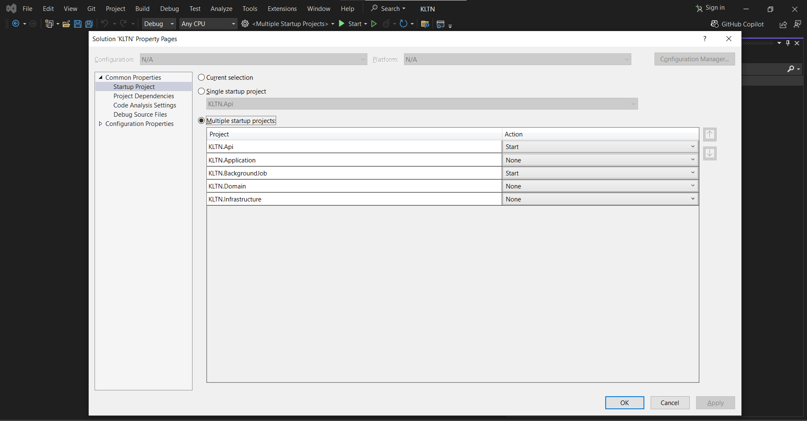

# Khóa luận tốt nghiệp
## Phần mềm trợ giúp giảng viên quản lý các nhóm đồ án môn học
Giúp giảng viên giảm tải công việc, nâng cao hiệu quả giảng dạy và cải thiện tương tác với sinh viên. Công nghệ hiện đại tối ưu quy trình, hỗ trợ theo dõi, đánh giá kịp thời và tạo môi trường học tập tích cực.


### Sinh viên thực hiện
| Họ tên      | MSSV      | Điểm      |
|------------|------------|------------|
| Biện Thành Hưng  | 3121410236  | 9.3  |
| Lê Tấn Minh Toàn  | 3121560092  | 9.3  |
### Yêu cầu hệ thống
#### Phần mềm
- Windows 10/11 (x64)
- Visual Studio
- Phiên bản .NET 8 hoặc mới hơn (Tải xuống từ [dotnet.microsoft.com](https://dotnet.microsoft.com/download))
- MySql Server
- Cài đặt *Entity Framework Core Tools* : `dotnet tool install --global dotnet-ef`
#### Phần cứng
- **CPU**: Intel Core i5 hoặc tương đương trở lên.
- **RAM**: 8GB hoặc nhiều hơn.
- **Dung lượng ổ đĩa**: Tối thiểu 2GB dung lượng trống. 
### Hướng dẫn chạy ứng dụng
Dự án này yêu cầu một số biến cấu hình để hoạt động chính xác. Các biến này có thể được đặt trong tệp `appsettings.json`, `appsettings.Development.json`, hoặc thông qua các **biến môi trường** khi triển khai lên môi trường production.

**Trong dự án KLTN.Api**
- DefaultConnection : Được sử dụng để kết nối tới cơ sở dữ liệu
    ```json
    "ConnectionStrings": {
        "DefaultConnection": "Server=example_server;Database=example_database;User=example_user;Password=example_password"
    },
    ```
    Thay đổi thông tin **Server**, **Database**, **User**, và Password phù hợp với cơ sở dữ liệu
- Cấu hình JWT : cấu hình này được sử dụng để tạo và xác thực JWT token.
    ```json
    "JWT": {
        "Issuer": "http://localhost:5000",
        "Audience": "http://localhost:5000",
        "SigningKey": "mC5w4I6e9sV2X7rF8gH2jL9qT1uV0wZ3"
    },
    ```
    * `JWT:Issuer`: Địa chỉ của server phát hành token
    * `JWT:Audience` : Địa chỉ mà token sẽ được gửi tới (thường giống với Issuer trong môi trường phát triển)
    * `JWT:SigningKey`: Khóa bí mật dùng để ký token (phải là một chuỗi có độ dài đủ mạnh, tối thiểu 32 ký tự).
- Cấu hình AWS :  thông tin này được sử dụng để tích hợp với AWS S3 cho việc lưu trữ tệp tin.
    ```json
     "AWS": {
        "Region": "ap-southeast-1",
        "BucketName": "classroom-cloud-storage",
        "Profile": "class-application"
    },
    ```
    * `AWS:Region`: Khu vực AWS của bạn (ví dụ: ap-southeast-1)
    * `AWS:BucketName` :  Tên bucket S3 bạn sử dụng
    * `AWS:Profile` : Tên profile AWS được cấu hình
    * **Lưu ý** : trước đó cần phải cấu hình profile AWS trên máy tính của bạn : [Hướng dẫn cấu hình aws profile ](https://iriscompanyio.medium.com/how-to-set-up-and-use-multiple-aws-profiles-using-aws-cli-00881cf93f4c)

- Cấu hình để gửi Email 
    ```json
      "SMTPEmailSettings": {
        "DisplayName": "Classroom Application",
        "EnableVerification": false,
        "From": "classroomApplication@edu.vn.com",
        "UserName": "khoaluantotnghiep2425@gmail.com",
        "Host": "smtp.gmail.com",
        "UseSsl": true,
        "Port": 465,
        "Password": "",
        "TemplateFolderPath": "../KLTN.Infrastructure/EmailTemplates"
    },
    ```
    * `SMTPEmailSettings:DisplayName`: Tên hiển thị khi gửi email.

    * `SMTPEmailSettings:EnableVerification`: Bật/tắt chức năng xác minh qua email (true/false).

    * `SMTPEmailSettings:From`: Email người gửi.

    * `SMTPEmailSettings:UserName`: Tên tài khoản email.

    * `SMTPEmailSettings:Host`: SMTP server (ví dụ: smtp.gmail.com).

    * `SMTPEmailSettings:UseSsl`: Có sử dụng SSL không (true/false).

    * `SMTPEmailSettings:Port`: Cổng SMTP (thường là 465 hoặc 587).

    * `SMTPEmailSettings:Password`: Mật khẩu của email.

    * `SMTPEmailSettings:TemplateFolderPath`: Đường dẫn tới thư mục chứa template email.

- Cấu hình để tích hợp tính năng đăng nhập bằng Gmail

    ```json
    "GoogleOptions": {
        "ClientId": "",
        "ClientSecret": "",
        "CallbackPath": ""
    }
    ```
    * `ClientId` :   ID của ứng dụng được tạo trong Google Cloud Console (OAuth 2.0 Client ID).
    * `ClientSecret`: mã bí mật được liên kết với ứng dụng (Client) trong Google Cloud Console
    * `CallbackPath`: đường dẫn mà Google sẽ chuyển hướng người dùng sau khi họ đăng nhập thành công 
    * [Hướng dẫn thiết lập bên Google Cloud Console](https://xuanthulab.net/asp-net-razor-su-dung-tai-khoan-google-de-xac-thuc-trong-identity.html)
- Khác 
    ```json
      "ClientUrl": "http://localhost:8888",
      "BackgroundJobUrl": "http://localhost:5001"
    ```
    * `ClientUrl` : đường dẫn đến ứng dụng front end
    * `BackgroundJobUrl` : đường dẫn đến ứng dụng chuyên chạy các công việc chạy ngầm

**Trong dự án KLTN.BackgroundJob**
- Cấu hình để gửi Email (xem lại hướng dẫn thiết lập trong dự án **KLTN.Api**)

- Thiết lập các cấu hình cần thiết cho Hangfire
    * Hangfire là một thư viện mã nguồn mở trong .NET dùng để quản lý và xử lý các tác vụ nền (background jobs) một cách dễ dàng, đáng tin cậy, và hỗ trợ lập lịch.

    *
        ```json
        "HangFireSettings": {
            "Route": "/jobs",
            "ServerName": "Hangfire API",
            "Dashboard": {
                "AppPath": "/",
                "StatsPollingInterval": 2000,
                "DashboardTitle": "Jobs"
            },
            "Storage": {
                "DBProvider": "mysql",
                "ConnectionString": ""
            }
        },
        ```
    * `Route` : đường dẫn nơi Hangfire Dashboard sẽ được truy cập
    * `ServerName` : Tên hiển thị của Hangfire Server khi nó được kết nối và quản lý các tác vụ nền
    * `Dashboard`
        * `AppPath` : Đường dẫn quay lại ứng dụng chính từ Hangfire Dashboard
        * `StatsPollingInterval` : Kiểm soát tần suất làm mới Dashboard để hiển thị thông tin mới nhất về các tác vụ
        * `DashboardTitle`: tiêu đề hiển thị trên Hangfire Dashboard
    * `Storage`:
        * `DBProvider`: Loại cơ sở dữ liệu được sử dụng để lưu trữ dữ liệu của Hangfire (các job và trạng thái của chúng)
        * `ConnectionString` : Chuỗi kết nối đến cơ sở dữ liệu được sử dụng bởi Hangfire

**Chạy ứng dụng**
Chuột phải vào **Solutions** => Chọn **Configure Startup Project..** => Tích chọn **Multiple startup projects** và thiết lập như trong ảnh

